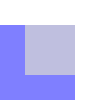

# alpha-blend

Alpha blending and compositing in (optionally) zero-dependency Rust.

[](https://github.com/crates-lurey-io/alpha-blend/actions/workflows/test.yml)
[](https://github.com/crates-lurey-io/alpha-blend/actions/workflows/docs.yml)
[](https://crates.io/crates/alpha-blend)
[](https://codecov.io/gh/crates-lurey-io/alpha-blend)

## Examples

```sh
cargo run --example porter-duff --features bytemuck
```

### `BlendMode::Clear`


### `BlendMode::Source`


### `BlendMode::Destination`


### `BlendMode::SourceOver`


### `BlendMode::DestinationOver`


### `BlendMode::SourceIn`


### `BlendMode::DestinationIn`


### `BlendMode::SourceOut`



### `BlendMode::DestinationOut`


### `BlendMode::SourceAtop`


### `BlendMode::DestinationAtop`


### `BlendMode::Xor`


### `BlendMode::Plus`


## Contributing

This project uses [`just`][] to run commands the same way as the CI:

- `cargo just check` to check formatting and lints.
- `cargo just coverage` to generate and preview code coverage.
- `cargo just doc` to generate and preview docs.
- `cargo just test` to run tests.

[`just`]: https://crates.io/crates/just

For a full list of commands, see the [`Justfile`](./Justfile).
